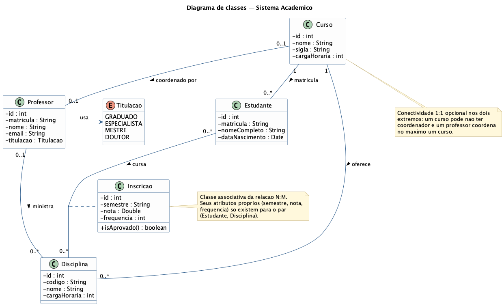
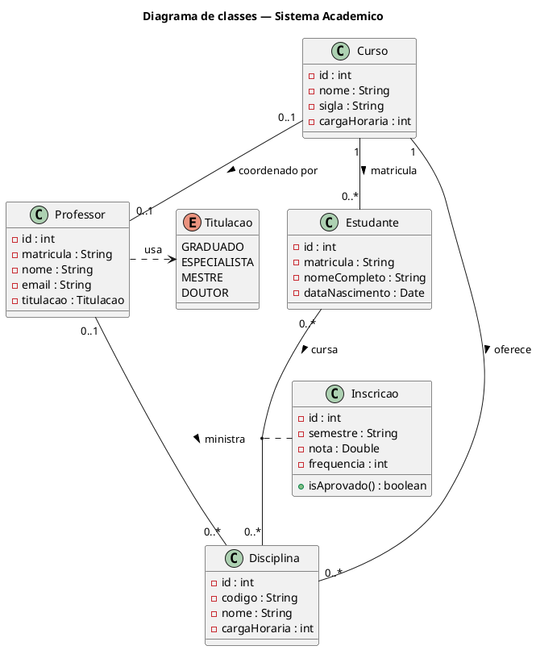
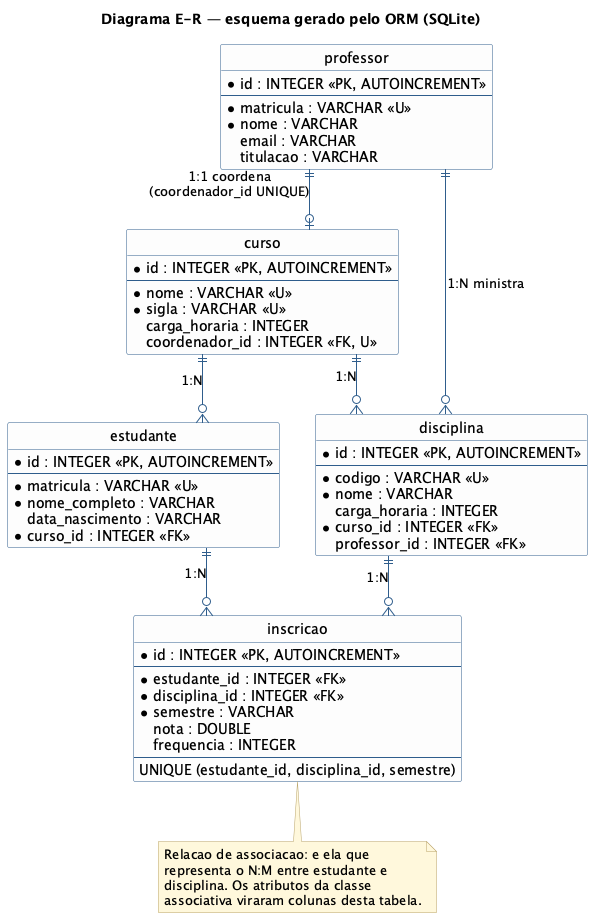
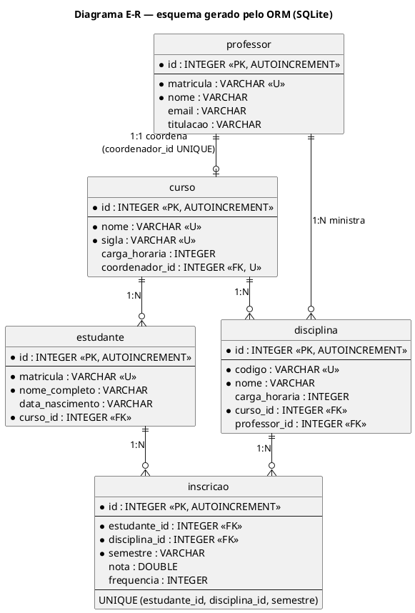
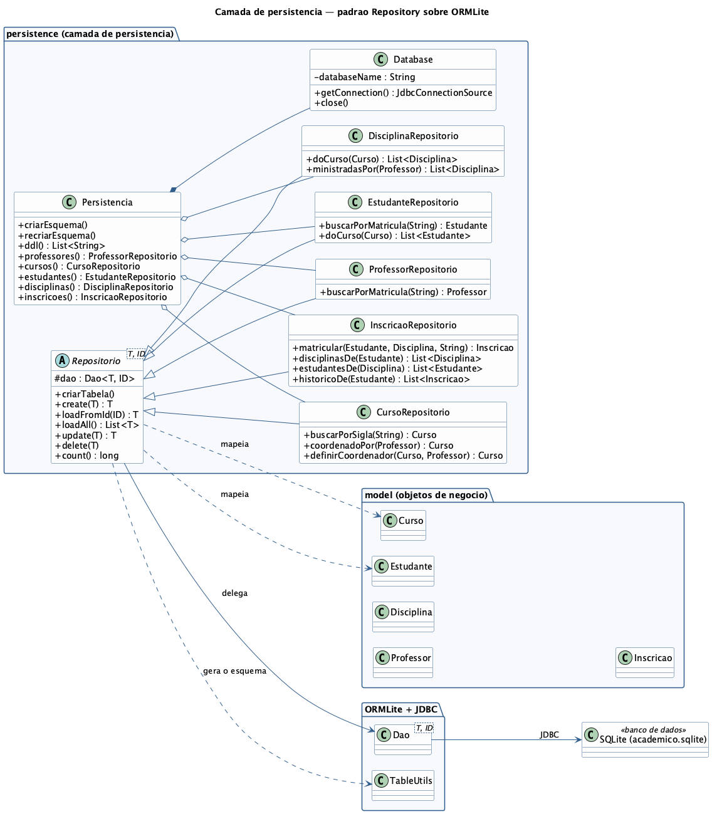

# Mapeamento objeto-relacional — camada de persistência de um sistema acadêmico

Repositório da atividade da **Aula 13 — Mapeamento de objetos para o modelo relacional**
(Cap. 12 de *Princípios de Análise e Projeto de Sistemas com UML*, Eduardo Bezerra).

O domínio é a continuação natural do projeto do grupo, que hoje tem um CRUD da entidade
`Estudante`: aqui ele cresce para um **sistema acadêmico** com curso, professor, disciplina e
inscrição, de modo a exercitar as três conectividades estudadas — **1:1, 1:N e N:M** — além de
uma **classe associativa**.

| Artefato pedido | Onde está |
|-----------------|-----------|
| 1. Diagrama de classes (PlantUML) | [`docs/diagrama-classes.puml`](docs/diagrama-classes.puml) · [`docs/diagrama-classes.png`](docs/diagrama-classes.png) |
| 2. Diagrama E-R (classes → tabelas) | [`docs/diagrama-er.puml`](docs/diagrama-er.puml) · [`docs/diagrama-er.png`](docs/diagrama-er.png) |
| 3. Camada de persistência | [`src/main/java/model/`](src/main/java/model) e [`src/main/java/persistence/`](src/main/java/persistence) |
| 4. Notebook Jupyter com os testes | [`notebooks/testes-persistencia.ipynb`](notebooks/testes-persistencia.ipynb) |

Framework ORM: **ORMLite 6.1** sobre **SQLite**, em **Java 21** — o mesmo empilhamento já usado
pelo grupo no CRUD em JavaFX.

---

## 1. Como executar

| Item | Versão | Observação |
|------|--------|------------|
| JDK | 21 (LTS) | `export JAVA_HOME=$(/usr/libexec/java_home -v 21)` se houver mais de um JDK |
| Maven | 3.9+ | baixa ORMLite e o driver SQLite |
| Jupyter + kernel IJava | — | só para o notebook; instruções na seção 5 |

```bash
mvn -q package
```

Esse comando compila, roda os testes JUnit, gera `target/orm-academico-1.0.0.jar` e copia as
dependências para `target/dependency` — é dessa pasta que o notebook carrega as bibliotecas.

Roteiro de demonstração em linha de comando:

```bash
java -cp "target/orm-academico-1.0.0.jar:target/dependency/*" app.Main
```

Regerar o DDL documentado em `docs/esquema.sql`:

```bash
java -cp "target/orm-academico-1.0.0.jar:target/dependency/*" app.GerarEsquema > docs/esquema.sql
```

Regerar as imagens a partir dos fontes `.puml` (requer `plantuml.jar`):

```bash
java -jar plantuml.jar -tpng docs/*.puml
```

---

## 2. Artefato 1 — Diagrama de classes



As associações do modelo:

| Associação | Conectividade | Leitura |
|------------|---------------|---------|
| `Curso` — `Professor` | **1:1** | um curso tem no máximo um coordenador; um professor coordena no máximo um curso |
| `Curso` — `Estudante` | **1:N** | um curso matricula muitos estudantes; todo estudante pertence a um curso |
| `Curso` — `Disciplina` | **1:N** | um curso oferece muitas disciplinas |
| `Professor` — `Disciplina` | **1:N** | um professor ministra muitas disciplinas |
| `Estudante` — `Disciplina` | **N:M** | um estudante cursa muitas disciplinas e vice-versa |
| `Inscricao` | classe associativa | atributos que só existem para o par (estudante, disciplina): semestre, nota, frequência |

Código-fonte — [`docs/diagrama-classes.puml`](docs/diagrama-classes.puml):



O arquivo versionado traz ainda as notas explicativas e os ajustes de estilo, omitidos acima
por brevidade.

---

## 3. Artefato 2 — Diagrama E-R (mapeamento das classes em tabelas)



### Regras aplicadas

| Elemento do modelo de classes | Regra do capítulo | Resultado no esquema |
|-------------------------------|-------------------|----------------------|
| Cada classe | classe → relação | `professor`, `curso`, `estudante`, `disciplina` |
| Identidade dos objetos | coluna de implementação como chave primária | `id INTEGER PRIMARY KEY AUTOINCREMENT` em todas as tabelas |
| `Curso` 0..1 — 0..1 `Professor` | 1:1 → chave estrangeira em **uma** das relações | `curso.coordenador_id` + `UNIQUE (coordenador_id)` |
| `Curso` 1 — * `Estudante` | 1:N → chave estrangeira no lado *muitos* | `estudante.curso_id NOT NULL` |
| `Curso` 1 — * `Disciplina` | 1:N | `disciplina.curso_id NOT NULL` |
| `Professor` 0..1 — * `Disciplina` | 1:N com participação opcional | `disciplina.professor_id` (aceita `NULL`) |
| `Estudante` * — * `Disciplina` | N:M → relação de associação | tabela `inscricao` com `estudante_id` e `disciplina_id` |
| `Inscricao` (classe associativa) | atributos da associação viram colunas da relação de associação | `semestre`, `nota`, `frequencia` em `inscricao` |
| Chave da relação de associação | coluna de implementação + unicidade lógica | `id` como PK e `UNIQUE (estudante_id, disciplina_id, semestre)` |
| `Titulacao` (enumeração) | tipo sem equivalente relacional | coluna `VARCHAR` com o nome da constante |
| `dataNascimento : Date` | tipo sem equivalente no SQLite | coluna `VARCHAR` no formato `yyyy-MM-dd` |

O ponto central do 1:1: **a chave estrangeira sozinha produziria um 1:N**. É a restrição
`UNIQUE` sobre `coordenador_id` que impede o mesmo professor de aparecer como coordenador de
dois cursos — e o notebook comprova isso com um teste que o banco recusa.

Por que `UNIQUE (estudante_id, disciplina_id, semestre)` e não apenas as duas chaves
estrangeiras: o semestre faz parte da identidade da associação, já que repetir uma disciplina
em outro período é legítimo.

Código-fonte — [`docs/diagrama-er.puml`](docs/diagrama-er.puml):



Notação pé de galinha: `||--o{` é um para muitos e `||--o|` é um para no máximo um. Como no
diagrama de classes, o arquivo versionado tem também as notas e os ajustes de estilo.

### DDL efetivamente gerado

O esquema não foi escrito à mão: o ORMLite o deriva das anotações das entidades
(`TableUtils`). O arquivo [`docs/esquema.sql`](docs/esquema.sql) é a saída de `app.GerarEsquema`:

```sql
CREATE TABLE `curso` (`id` INTEGER PRIMARY KEY AUTOINCREMENT , `nome` VARCHAR NOT NULL ,
  `sigla` VARCHAR NOT NULL , `carga_horaria` INTEGER , `coordenador_id` INTEGER ,
  UNIQUE (`nome`),  UNIQUE (`sigla`),  UNIQUE (`coordenador_id`)) ;

CREATE TABLE `inscricao` (`id` INTEGER PRIMARY KEY AUTOINCREMENT ,
  `estudante_id` INTEGER NOT NULL , `disciplina_id` INTEGER NOT NULL ,
  `semestre` VARCHAR NOT NULL , `nota` DOUBLE PRECISION , `frequencia` INTEGER ,
  UNIQUE (`estudante_id`,`disciplina_id`,`semestre`) ) ;
```

---

## 4. Artefato 3 — Camada de persistência

```
src/main/java/
├── model/                        objetos de negócio (POJOs anotados)
│   ├── Curso.java                1:1 com Professor, 1:N com Estudante e Disciplina
│   ├── Professor.java
│   ├── Estudante.java            lado "muitos" do 1:N com Curso
│   ├── Disciplina.java           lado "muitos" de dois 1:N
│   ├── Inscricao.java            classe associativa do N:M
│   └── Titulacao.java            enumeração
├── persistence/                  CAMADA DE PERSISTÊNCIA
│   ├── Database.java             fonte de conexão JDBC (único ponto que conhece o SGBD)
│   ├── Repositorio.java          repositório genérico: CRUD + geração de tabela
│   ├── ProfessorRepositorio.java
│   ├── CursoRepositorio.java     navegação 1:1 e bloqueio de remoção com dependentes
│   ├── EstudanteRepositorio.java navegação 1:N
│   ├── DisciplinaRepositorio.java
│   ├── InscricaoRepositorio.java navegação N:M e remoção em cascata
│   ├── Persistencia.java         fachada: conexão + repositórios + esquema
│   └── Log.java                  controle do log SQL do ORMLite
└── app/
    ├── Main.java                 roteiro de demonstração
    └── GerarEsquema.java         imprime o DDL derivado das anotações
```



### Decisões de projeto

**Estratégia adotada:** *framework ORM* (ORMLite) combinado com o *padrão DAO/Repository*,
duas das quatro estratégias listadas na aula. O ORM resolve o descasamento de tipos e gera o
SQL; os repositórios isolam o resto do sistema, que nunca vê uma instrução SQL.

**Repositório genérico.** `Repositorio<T, ID>` concentra materialização, atualização e
remoção — os três aspectos enumerados no capítulo — e cada subclasse acrescenta só as
consultas próprias da entidade.

| Operação | Método | SQL emitido |
|----------|--------|-------------|
| Create | `create(T)` | `INSERT INTO ...` |
| Retrieve | `loadFromId(ID)` / `loadAll()` | `SELECT ... WHERE id = ?` / `SELECT *` |
| Update | `update(T)` | `UPDATE ... WHERE id = ?` |
| Delete | `delete(T)` | `DELETE FROM ... WHERE id = ?` |

**Navegação das associações.**

| Sentido | Implementação |
|---------|---------------|
| 1:1 `curso → coordenador` | coluna `coordenador_id` com `foreignAutoRefresh`: o objeto `Professor` vem preenchido |
| 1:1 `professor → curso` | `CursoRepositorio.coordenadoPor()`: `WHERE coordenador_id = ?` |
| 1:N lado *muitos* → *um* | atributo de referência na entidade filha |
| 1:N lado *um* → *muitos* | `ForeignCollection` com carga tardia, ou `EstudanteRepositorio.doCurso()` |
| N:M | `InscricaoRepositorio.disciplinasDe()` / `estudantesDe()`, que produzem `INNER JOIN` com a tabela de associação |

A navegação N:M usa `DISTINCT`: a junção devolve uma linha por inscrição e o mesmo par
(estudante, disciplina) pode existir em dois semestres. Sem isso, a disciplina repetida
apareceria duas vezes na lista de disciplinas cursadas — defeito que o notebook detectou.

**Integridade referencial.** O DDL que o ORMLite gera para o SQLite cria as colunas de chave
estrangeira, mas **não** declara restrições `FOREIGN KEY`; o banco aceitaria remoções que
deixam linhas órfãs. A camada assume essa responsabilidade em dois pontos:

- `CursoRepositorio.delete()` recusa remover um curso ainda referenciado;
- `Persistencia.removerEstudanteEmCascata()` apaga as linhas da associação antes do estudante
  — a remoção em cascata discutida no mapeamento de agregações.

### Testes automatizados

Além do notebook, a camada tem testes JUnit sobre banco em memória:

```bash
mvn -q test
```

```
Tests run: 10, Failures: 0, Errors: 0, Skipped: 0
```

---

## 5. Artefato 4 — Notebook de testes interativos

[`notebooks/testes-persistencia.ipynb`](notebooks/testes-persistencia.ipynb) — já versionado
**com as saídas de uma execução real**.

### Preparar o ambiente

```bash
pip install --user notebook nbconvert
curl -L -o ijava.zip https://github.com/SpencerPark/IJava/releases/download/v1.3.0/ijava-1.3.0.zip
unzip ijava.zip -d ijava && python3 ijava/install.py --user
```

```bash
mvn -q package          # gera os jars que o notebook carrega com %jars
jupyter notebook notebooks/testes-persistencia.ipynb
```

Para reexecutar tudo sem abrir o navegador:

```bash
jupyter nbconvert --to notebook --execute --inplace notebooks/testes-persistencia.ipynb
```

### O que o notebook avalia

| Seção | Verifica |
|-------|----------|
| 1 | o DDL derivado das anotações contém as chaves e restrições previstas nos diagramas |
| 2 | `INSERT` e devolução da chave primária gerada pelo banco |
| 3 | navegação 1:1 nos dois sentidos; o banco **recusa** dois cursos com o mesmo coordenador |
| 4 | navegação 1:N pelos repositórios e por `ForeignCollection` |
| 5 | navegação N:M; SQL da junção; inscrição duplicada recusada; repetição em outro semestre aceita |
| 6 | atributos da classe associativa e `UPDATE` de nota e frequência |
| 7 | materialização: fecha a conexão, reabre e reconstrói os objetos com as associações intactas |
| 8 | `DELETE` da associação, bloqueio de remoção com dependentes e remoção em cascata |
| 9 | conferência no nível relacional, com `JOIN` em SQL puro e `PRAGMA table_info` |
| 10 | relatório final |

Resultado da execução registrada no arquivo:

```
Testes executados : 46
Falhas            : 0

RESULTADO: camada de persistencia aprovada em todos os testes.
```

---

## 6. Correspondência com o conteúdo da aula

| Conceito | Onde aparece neste repositório |
|----------|-------------------------------|
| Objetos persistentes × transientes | entidades de `model/` são persistentes; os resultados de consulta em memória, transientes |
| Descasamento de informações (*impedance mismatch*) | `Titulacao` (enum) e `Date` sem equivalente no SQLite, convertidos pelo ORM |
| Classe → relação, atributo → coluna | `docs/esquema.sql` |
| Coluna de implementação como chave primária | `id` com `generatedId = true` em todas as entidades |
| Mapeamento 1:1 | `curso.coordenador_id` com `UNIQUE` |
| Mapeamento 1:N | `estudante.curso_id`, `disciplina.curso_id`, `disciplina.professor_id` |
| Mapeamento N:M | tabela `inscricao` |
| Classe associativa | atributos `semestre`, `nota`, `frequencia` na relação de associação |
| Mapeamento de agregações e remoção em cascata | `Persistencia.removerEstudanteEmCascata()` |
| Camada de persistência isolando o negócio | pacote `persistence`, fachada `Persistencia` |
| Estratégia DAO | `Repositorio<T, ID>` e subclasses |
| Estratégia framework ORM | ORMLite |
| Sobrecarga introduzida pela camada | `foreignAutoRefresh` gera consultas extras por objeto lido (visível com `Log.mostrarSql()`) |

## 7. Limitações conhecidas

- O esquema gerado não declara `FOREIGN KEY`; a integridade referencial é mantida pela camada
  de persistência, como descrito na seção 4.
- `mvn exec:java` executa o roteiro, mas o log do ORMLite escapa do controle de `Log` porque o
  Maven impõe a própria biblioteca de log ao *classpath*. Para a saída limpa, use a forma com
  `java -cp` da seção 1.
- O mapeamento de generalização não é exercitado: o modelo do grupo não tem hierarquia de
  herança entre entidades persistentes.
